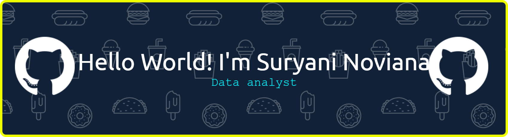

## Hello world! I'm Suryani Noviana 👋

<!--
**suryaninoviana/suryaninoviana** is a ✨ _special_ ✨ repository because its `README.md` (this file) appears on your GitHub profile.

Here are some ideas to get you started:

- 🔭 I’m currently working on ...
- 🌱 I’m currently learning ...
- 👯 I’m looking to collaborate on ...
- 🤔 I’m looking for help with ...
- 💬 Ask me about ...
- 📫 How to reach me: ...
- 😄 Pronouns: ...
- ⚡ Fun fact: ...
-->

- 🔭 I’m currently seeking **Junior Data Analyst / Junior Data Engineer** roles
- 🌱 I’m a recent graduate of **Hacktiv8 Comprehensive Data Analytics Bootcamp CODA-RMT-018** 
- 💻 I’m currently building **Portfolio Projects using Python, SQL, Airflow, and Tableau**
- 👯 I’m looking to collaborate on **Data Analytics Case Studies and ETL Projects**
- 🤔 I’m looking for help with **Best practices in Data Engineering & Cloud Deployment**
- 💬 Ask me about **Python, SQL, Excel, Tableau, ETL, and Data Warehousing**
- 📫 How to reach me: **suryani.noviana11@gmail.com**
- 😄 Pronouns: **She/Her**

##### Skill

  

##### Connect with me

### 📊 Featured Projects
1. **[Telemarketing Bank Campaign Analysis](link-github-kamu)**  
   End-to-end ETL with PySpark + Airflow + Star Schema Data Warehouse + Tableau Dashboard. 45,211 records analyzed.
2. **[Supplement Sales ETL Pipeline](link-github-kamu)**  
   Automated ETL with Data Validation using Great Expectations. Data loaded to MongoDB Atlas.
3. **[Domestic Airline Ticket Sales Analysis](link-github-kamu)**  
   ETL with Python + Pandas → Data Warehouse PostgreSQL → Dashboard Tableau
4. **[Kenes Leather Web Scraping ETL](link-github-kamu)**  
   Web scraping with BeautifulSoup → Data Cleaning with Pandas → Load to PostgreSQL

### 🎓 Certification
**Hacktiv8 - Comprehensive Data Analytics Bootcamp CODA-RMT-018**  
Issued July 2026 

<picture data-importer="pacman">
  <source media="(prefers-color-scheme: dark)" srcset="https://raw.githubusercontent.com/suryaninoviana/suryaninoviana/pacman-output/pacman-contribution-graph-dark.svg?game=pacman">
  <source media="(prefers-color-scheme: light)" srcset="https://raw.githubusercontent.com/suryaninoviana/suryaninoviana/pacman-output/pacman-contribution-graph.svg?game=pacman">
  
</picture>

